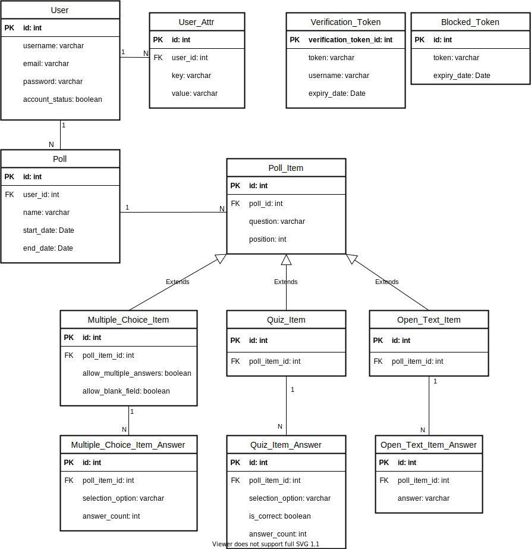

  
  <h3 align="center">Live-Poll API</h3>
  
Easy to use, web-based poll management system.

  

    
    
    
    
    
    
    
    
  

---

| :warning:   | All "Live-Poll" repos are not maintained anymore. It is a student project carried out in 2021 by us (three students) at uni. It showed us how to apply common software engineering best-practices as well as project management techniques. Our code (except for the logo) is available under the very permissive MIT-license, so feel free to continue the project on your own. |
|---------------|:-------------------------|

## Data structure

## Security policy
If you want to report a security vulnerability, please read our security policy in the [SECURITY.md](SECURITY.md) file.

© Live-Poll 2020-2021
